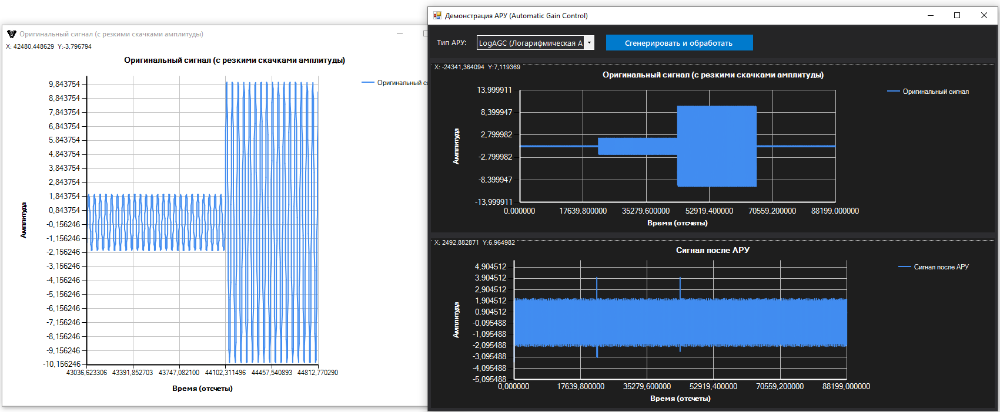

# Автоматическая регулировка усиления (АРУ / AGC)

## Содержание

1. [Назначение и задача](#1-назначение-и-задача)
2. [Математическая основа](#2-математическая-основа)
   - 2.1 [Оценка постоянной составляющей](#21-оценка-постоянной-составляющей)
   - 2.2 [DirectAGC — нормировка по RMS](#22-directagc--нормировка-по-rms)
   - 2.3 [LogAGC — логарифмическая огибающая](#23-logagc--логарифмическая-огибающая)
   - 2.4 [MinCombineAGC — комбинированная АРУ](#24-mincombineagc--комбинированная-ару)
3. [Работа алгоритма LogAGC: иллюстрация](#3-работа-алгоритма-logagc-иллюстрация)
4. [Сравнение алгоритмов](#4-сравнение-алгоритмов)
5. [API](#5-api)
6. [Пример использования](#6-пример-использования)

---

## 1. Назначение и задача

Автоматическая регулировка усиления (АРУ, англ. *Automatic Gain Control*, AGC) — алгоритм обработки сигналов, который приводит уровень сигнала к стабильной амплитуде вне зависимости от того, насколько громким или тихим был входной сигнал.

**Типичные применения:**

- приём радиосигнала при переменном уровне мощности;
- обработка речи и аудио с резкими перепадами громкости;
- нормализация показаний датчиков;
- предобработка перед цифровой демодуляцией (например, перед BPSK/QAM).

**Задача формально:** по входному потоку отсчётов $x[n]$ в реальном времени вычислить нормированный выход $y[n]$ такой, что дисперсия $y[n]$ остаётся приблизительно постоянной (равной 1), а постоянная составляющая — нулю:

$$y[n] = \frac{x[n] - \hat{\mu}[n]}{\hat{\sigma}[n]}$$

где $\hat{\mu}[n]$ — скользящее среднее, $\hat{\sigma}[n]$ — скользящее стандартное отклонение.

---

## 2. Математическая основа

Все алгоритмы в `AI.SignalLabs` работают **поотсчётно** (потоковый режим) и не требуют хранения буфера истории — состояние накапливается внутри пары **IIR-фильтров** нижних частот.

### 2.1 Оценка постоянной составляющей

Первый IIR-фильтр ($\text{FilterMean}$) отслеживает медленно меняющееся среднее:

$$\hat{\mu}[n] = \text{IIR}_\text{mean}\bigl(x[n]\bigr)$$

Разность

$$d[n] = x[n] - \hat{\mu}[n]$$

является переменной (AC) составляющей сигнала — именно она нормируется далее.

### 2.2 DirectAGC — нормировка по RMS

**Алгоритм:**

$$s[n] = d[n]^2$$

$$\hat{\sigma}^2[n] = \bigl|\text{IIR}_\text{std}\bigl(s[n]\bigr)\bigr|$$

$$y[n] = \frac{d[n]}{\sqrt{\hat{\sigma}^2[n]} + \varepsilon}$$

Здесь:
- $\hat{\sigma}^2[n]$ — оценка дисперсии через IIR-фильтр от квадрата AC-составляющей;
- $\varepsilon$ (`GlobalEps`) — малая добавка, предотвращающая деление на нуль в тишине;
- `Math.Abs` вокруг `FilterOutp` защищает `Math.Sqrt` от отрицательного аргумента, который может возникнуть из-за численных погрешностей IIR.

**Физический смысл:** делитель равен RMS (среднеквадратичному значению) сигнала. При постоянном уровне $y[n]$ сходится к стандартизованному сигналу с $\sigma \approx 1$.

**Переходной процесс:** если амплитуда резко возросла, $\hat{\sigma}^2$ начинает расти, но с задержкой, определяемой полосой IIR-фильтра. В этот момент $y[n]$ кратковременно превышает порог `TresholdAGC` — срабатывает жёсткий клиппер `OutpClip`.

### 2.3 LogAGC — логарифмическая огибающая

**Алгоритм:**

$$s_{\log}[n] = \ln\bigl(d[n]^2 + \varepsilon\bigr)$$

$$\hat{L}[n] = \frac{\text{IIR}_\text{std}\bigl(s_{\log}[n]\bigr)}{2}$$

$$y[n] = \frac{d[n]}{e^{\hat{L}[n]}}$$

**Математическое обоснование:**

Геометрическое среднее положительной случайной величины $|d|$ выражается через математическое ожидание её логарифма:

$$\text{GM}(|d|) = \exp\!\bigl(E[\ln|d|]\bigr)$$

Поскольку $\ln(d^2) = 2\ln|d|$, делитель вычисляется как:

$$e^{\hat{L}[n]} = \exp\!\left(\frac{E[\ln d^2]}{2}\right) = \exp\!\bigl(E[\ln|d|]\bigr) \approx \text{GM}(|d|)$$

Таким образом, LogAGC нормирует сигнал на **геометрическое среднее огибающей**, а не на RMS.

**Преимущество перед DirectAGC:** логарифм значительно ослабляет влияние импульсных выбросов (щелчков, кратковременных пиков) на оценку нормирующего уровня. Если в тишине возникнет одиночный мощный импульс:
- в `DirectAGC` $d[n]^2$ создаёт большой выброс, который медленно «уходит» из IIR-фильтра, подавляя громкость полезного сигнала на долгое время;
- в `LogAGC` $\ln(d^2)$ сжимает тот же выброс в логарифмической шкале, и его влияние на $\hat{L}$ оказывается значительно меньше.

### 2.4 MinCombineAGC — комбинированная АРУ

**Алгоритм:**

$$y_1[n] = \text{DirectAGC}(x[n])$$

$$y_2[n] = \text{LogAGC}(x[n])$$

$$y[n] = \begin{cases} y_2[n], & |y_1[n]| > |y_2[n]| \\ y_1[n], & \text{иначе} \end{cases}$$

**Смысл:** `DirectAGC` и `LogAGC` имеют разные кривые атаки — разный переходной процесс при резком изменении амплитуды. В каждый момент времени выбирается тот выход, который **по модулю меньше**, то есть более агрессивно подавляет текущий всплеск. Это эффективно срезает выбросы в момент атаки и ускоряет стабилизацию уровня.

---

## 3. Работа алгоритма LogAGC: иллюстрация

На скриншоте ниже показан результат обработки тестового синтетического сигнала алгоритмом `LogAGC`.



**Тестовый сигнал** — синусоида частотой 1 кГц с резкими скачками амплитуды:

| Временной диапазон | Амплитуда |
|--------------------|-----------|
| 0.0 – 0.5 с       | 0.1 (тихий сигнал) |
| 0.5 – 1.0 с       | 2.0 (средний) |
| 1.0 – 1.5 с       | 10.0 (громкий всплеск) |
| 1.5 – 2.0 с       | 0.1 (снова тихий) |

**Что видно на графиках:**

- **Верхний график** — оригинальный сигнал. Наглядно видны скачки амплитуды: тихая область в начале, затем два ступенчатых увеличения (×20 и ×100 от начального уровня) и возврат к тишине в конце.

- **Нижний график** — сигнал после LogAGC. Все три уровня приведены к примерно одинаковой амплитуде (≈±4 — предел клиппера `TresholdAGC = 4`). В момент резкого скачка (переход с 0.5 на 1.0 с) виден кратковременный выброс — это переходной процесс IIR-фильтра, который «догоняет» новый уровень. После стабилизации (≈0.1–0.2 с) сигнал выравнивается.

> **Ключевой вывод:** алгоритм LogAGC успешно компрессирует динамический диапазон в 100 раз (от 0.1 до 10.0), при этом форма сигнала (синусоида) сохраняется в установившемся режиме.

---

## 4. Сравнение алгоритмов

| Характеристика | DirectAGC | LogAGC | MinCombineAGC |
|---|---|---|---|
| Нормирующий уровень | RMS (среднеквадратичное) | Геометрическое среднее огибающей | Минимум из двух |
| Устойчивость к импульсным помехам | Низкая (квадрат не сжимает выбросы) | Высокая (логарифм сжимает выбросы) | Высокая |
| Переходной процесс (атака) | Медленнее при больших скачках | Быстрее при импульсах | Минимальный из двух |
| Вычислительная сложность | Низкая | Низкая (одна `ln` + одна `exp`) | Вдвое выше (два AGC параллельно) |
| Применение | Аудио, связь, общее назначение | Сигналы с импульсными помехами, широкий динамический диапазон | Когда важен минимальный переходной процесс |

---

## 5. API

### Интерфейс `IAGC`

```csharp
public interface IAGC
{
    // Клиппинг выхода АРУ (по умолчанию ±4)
    double TresholdAGC { get; set; }

    // Клиппинг внутри IIR-фильтров
    double TresholdFilter { get; set; }

    // Обработать один отсчёт (потоковый режим)
    double Calculate(double value);
}
```

### `DirectAGC`

```csharp
// Конструктор по умолчанию (встроенные коэффициенты фильтра)
var agc = new DirectAGC();

// Из файла с коэффициентами IIR
var agc = new DirectAGC("path/to/filter.bin");

// Явные коэффициенты
var agc = new DirectAGC(kefA, kefB);
```

### `LogAGC`

```csharp
var agc = new LogAGC(); // наследует от DirectAGC
```

### `MinCombineAGC`

```csharp
// По умолчанию: DirectAGC + LogAGC
var agc = new MinCombineAGC();

// Произвольная пара
var agc = new MinCombineAGC(agc1: new DirectAGC(), agc2: new LogAGC(), tresholdAGC: 4.0);
```

**Свойства, общие для всех:**

| Свойство | Тип | Описание |
|---|---|---|
| `TresholdAGC` | `double` | Жёсткое ограничение выходного сигнала (по умолчанию `4.0`) |
| `TresholdFilter` | `double` | Ограничение внутри IIR-фильтров для предотвращения насыщения |

---

## 6. Пример использования

### Обработка вектора сигнала

```csharp
using AI.SignalLab.AGC;
using AI.SignalLab.AGC.CustomAGC;
using AI.DataStructs.Algebraic;

// Выбор алгоритма
IAGC agc = new LogAGC();

// Сигнал с переменной амплитудой
Vector signal = GenerateTestSignal(); // ваши данные

// Потоковая обработка отсчёт за отсчётом
Vector processed = new Vector(signal.Count);
for (int i = 0; i < signal.Count; i++)
{
    processed[i] = agc.Calculate(signal[i]);
}
```

### Настройка порогов

```csharp
var agc = new DirectAGC
{
    TresholdAGC    = 3.0,  // ограничение выхода ±3σ
    TresholdFilter = 50.0  // защита IIR от насыщения
};
```

### Комбинированная АРУ с произвольными компонентами

```csharp
var agc = new MinCombineAGC(
    agc1: new DirectAGC(),
    agc2: new LogAGC(),
    tresholdAGC: 4.0
);

double sample = 0.5;
double normalized = agc.Calculate(sample);
```

---

## Зависимости

- `AI.DSP.IIR.IIRFilter` — рекурсивный IIR-фильтр нижних частот (из `AIFrameworkOpen`).
- `AISettings.GlobalEps` — глобальная машинная эпсилон-добавка.

Встроенные коэффициенты фильтров хранятся в ресурсе `filters.resx` в виде байтовых массивов, загружаемых через `IIRFilter.Load(byte[])`.
