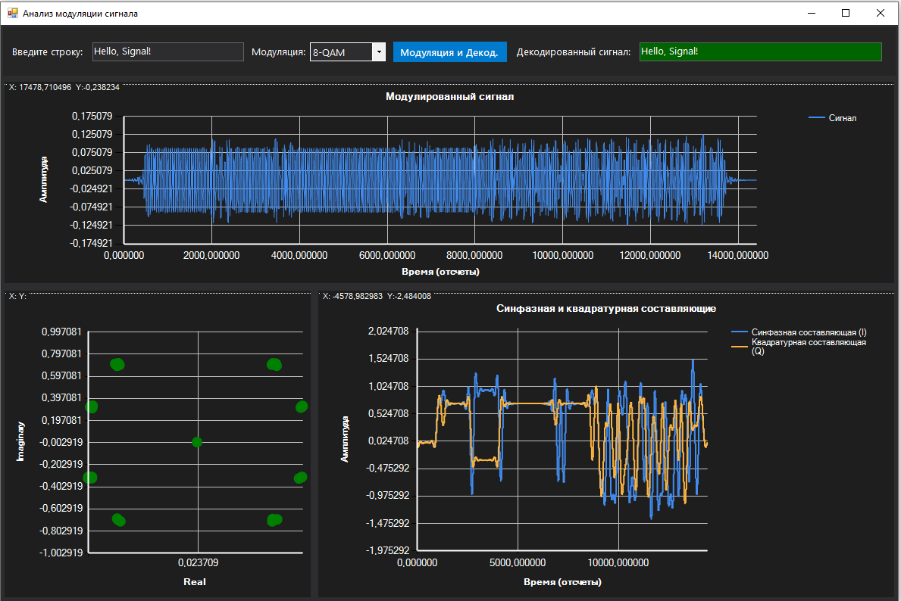

# Цифровая модуляция сигналов

## Содержание

1. [Введение: квадратурная модуляция](#1-введение-квадратурная-модуляция)
2. [Цепочка передачи и приёма](#2-цепочка-передачи-и-приёма)
3. [Созвездия: теория и реализация](#3-созвездия-теория-и-реализация)
   - 3.1 [BPSK](#31-bpsk)
   - 3.2 [QPSK](#32-qpsk)
   - 3.3 [8-QAM](#33-8-qam)
   - 3.4 [16-QAM](#34-16-qam)
4. [Маппинг и демаппинг](#4-маппинг-и-демаппинг)
5. [Фильтр SRRC: нулевая МСИ](#5-фильтр-srrc-нулевая-мси)
6. [Квадратурная демодуляция](#6-квадратурная-демодуляция)
7. [Результат работы: иллюстрация](#7-результат-работы-иллюстрация)
8. [API](#8-api)
9. [Полный пример кода](#9-полный-пример-кода)

---

## 1. Введение: квадратурная модуляция

Современные цифровые системы связи используют **квадратурную модуляцию** — метод, при котором информация кодируется одновременно в **амплитуде** и **фазе** несущей через две ортогональные составляющие:

$$s(t) = I(t) \cdot \cos(2\pi f_0 t) + Q(t) \cdot \sin(2\pi f_0 t)$$

где:
- $I(t)$ — **синфазная** составляющая (*In-Phase*);
- $Q(t)$ — **квадратурная** составляющая (*Quadrature*);
- $f_0$ — несущая частота.

Каждая пара значений $(I, Q)$ задаёт **символ** — точку на комплексной плоскости. Множество всех возможных символов называется **созвездием** (*constellation*). Выбор количества точек в созвездии определяет количество бит, передаваемых за один символ:

$$k = \log_2 M$$

где $M$ — мощность созвездия (2, 4, 8, 16 и т.д.).

---

## 2. Цепочка передачи и приёма

Полная схема канала связи в `AI.SignalLabs`:

```
┌─────────┐    ┌──────────┐    ┌─────────────┐    ┌─────────────┐    ┌──────────┐
│  Биты   │───▶│ Маппинг  │───▶│  TX SRRC    │───▶│  Модуляция  │───▶│  Канал   │
│ (bool[])│    │ (символы)│    │(I и Q канал)│    │ I·cos+Q·sin │    │ (шум,    │
└─────────┘    └──────────┘    └─────────────┘    └─────────────┘    │ замирания│
                                                                       └────┬─────┘
                                                                            │
┌─────────┐    ┌──────────┐    ┌─────────────┐    ┌─────────────┐         │
│  Биты   │◀───│Демаппинг │◀───│  RX SRRC    │◀───│Квадратурный │◀────────┘
│ (bool[])│    │  (MDD)   │    │  (I и Q)    │    │демодулятор  │
└─────────┘    └──────────┘    └─────────────┘    └─────────────┘
```

**Шаги передатчика:**

1. Данные (байты) → битовый поток `bool[]`.
2. Биты группируются по $k$ штук и маппируются в точки созвездия $(I_n, Q_n)$.
3. Из $(I_n, Q_n)$ формируются **импульсы Дирака** — ненулевое значение ставится только в начало каждого символа (остальные отсчёты — нули).
4. Импульсы пропускаются через **SRRC-фильтр** на передатчике (формирование импульса).
5. Отфильтрованные сигналы $I(t)$ и $Q(t)$ модулируются на несущую.

**Шаги приёмника:**

1. Входной сигнал умножается на $\cos(2\pi f_0 t)$ и $\sin(2\pi f_0 t)$ (квадратурное разложение).
2. Результаты фильтруются **SRRC-фильтром** на приёмнике (согласованный фильтр).
3. В центре каждого символа (с компенсацией задержки TX+RX фильтров) производится **выборка** точки созвездия.
4. Каждая точка декодируется в биты методом **ближайшей точки** (Minimum Distance Decoding).

---

## 3. Созвездия: теория и реализация

Все созвездия в `AI.SignalLabs` нормированы к **единичной средней мощности**:

$$P = \frac{1}{M} \sum_{i=1}^{M} |c_i|^2 = 1$$

Это позволяет сравнивать разные модуляции при одинаковом SNR.

### 3.1 BPSK

**Binary Phase Shift Keying** — двоичная фазовая манипуляция.

- Бит на символ: **1**
- Точек в созвездии: **2**

| Биты | I    | Q    |
|------|------|------|
| `0`  | −1   | 0    |
| `1`  | +1   | 0    |

Нормировочный коэффициент: $1$ (точки уже на единичной окружности).

**Минимальное расстояние:** $d_{\min} = 2$. BPSK — наиболее помехоустойчивая из рассматриваемых модуляций при заданной мощности сигнала, однако передаёт лишь 1 бит/символ.

### 3.2 QPSK

**Quadrature Phase Shift Keying** — квадратурная фазовая манипуляция.

- Бит на символ: **2**
- Точек в созвездии: **4**

| Биты | I      | Q      |
|------|--------|--------|
| `00` | −1/√2  | −1/√2  |
| `01` | +1/√2  | −1/√2  |
| `10` | −1/√2  | +1/√2  |
| `11` | +1/√2  | +1/√2  |

Нормировочный коэффициент: $1/\sqrt{2}$.

**Свойство:** при одинаковом SNR QPSK имеет ту же вероятность ошибки на бит, что и BPSK, но вдвое выше спектральную эффективность (2 бит/с/Гц).

### 3.3 8-QAM

**8-level Quadrature Amplitude Modulation**.

- Бит на символ: **3**
- Точек в созвездии: **8**

Четыре точки образуют «кольцо» малого радиуса, ещё четыре — «кольцо» большого радиуса:

| Биты | I         | Q         | Формула            |
|------|-----------|-----------|--------------------|
| 000  | +1/√2     | +1/√2     | (+1,+1)/√2         |
| 001  | −1/√2     | +1/√2     | (−1,+1)/√2         |
| 010  | −1/√2     | −1/√2     | (−1,−1)/√2         |
| 011  | +1/√2     | −1/√2     | (+1,−1)/√2         |
| 100  | +3/√10    | +1/√10    | (+3,+1)/√10        |
| 101  | −3/√10    | +1/√10    | (−3,+1)/√10        |
| 110  | −3/√10    | −1/√10    | (−3,−1)/√10        |
| 111  | +3/√10    | −1/√10    | (+3,−1)/√10        |

Нормировочные коэффициенты: $1/\sqrt{2}$ для внутренних точек, $1/\sqrt{10}$ для внешних. Проверка: $\frac{4 \cdot (1^2+1^2)/2 + 4 \cdot (9+1)/10}{8} = \frac{4+4}{8} = 1$ ✓

### 3.4 16-QAM

**16-level Quadrature Amplitude Modulation**.

- Бит на символ: **4**
- Точек в созвездии: **16**

Созвездие — равномерная сетка 4×4 с уровнями $\{-3, -1, +1, +3\}$ по каждой оси.

Нормировочный коэффициент: $1/\sqrt{10}$.

Проверка средней мощности:

$$P = \frac{1}{16}\sum_{i \in \{-3,-1,1,3\}}\sum_{q \in \{-3,-1,1,3\}} \frac{i^2 + q^2}{10} = \frac{2 \cdot (9+1+1+9)}{10} = \frac{40}{10} \cdot \frac{1}{4} \cdot 2 = 1 \checkmark$$

**Сравнение спектральной эффективности:**

| Модуляция | Бит/символ | Спектральная эффективность | Относительная помехоустойчивость |
|-----------|:----------:|:--------------------------:|:--------------------------------:|
| BPSK      | 1          | 1 бит/с/Гц               | Наивысшая                        |
| QPSK      | 2          | 2 бит/с/Гц               | Высокая                          |
| 8-QAM     | 3          | 3 бит/с/Гц               | Средняя                          |
| 16-QAM    | 4          | 4 бит/с/Гц               | Ниже                             |

---

## 4. Маппинг и демаппинг

### Маппинг (кодирование)

Метод `BaseIQModulation.MapBitsToSymbols(bool[] bits)`:

1. Если длина `bits` не кратна `BitsPerSymbol` — добавляются нулевые биты в конец (padding).
2. Биты читаются группами по `BitsPerSymbol`: биты $b_0, b_1, \ldots, b_{k-1}$ → индекс $i = b_0 + 2b_1 + \ldots + 2^{k-1} b_{k-1}$.
3. Возвращается `Constellation[i]`.

```
Пример для 8-QAM (k=3):
биты: [1, 0, 1] → индекс = 1·1 + 0·2 + 1·4 = 5 → Constellation[5] = (−3,+1)/√10
```

### Демаппинг — Minimum Distance Decoding (MDD)

Метод `DemapSymbolsToBits(ComplexVector iqSymbols, int expectedBits)`:

Для каждого принятого символа $\hat{c}$ находится точка созвездия с минимальным Евклидовым расстоянием:

$$\hat{i} = \arg\min_{i} \|\hat{c} - c_i\|_2$$

Это реализация **мягкого декодирования по максимуму правдоподобия** (ML decoding) при предположении о гауссовском шуме в канале.

```
Пример:
принято: (0.68, 0.68) → ближайшая точка Constellation[0] = (0.707, 0.707)
→ биты: 000
```

---

## 5. Фильтр SRRC: нулевая МСИ

### Проблема межсимвольной интерференции (МСИ)

Если передавать прямоугольные импульсы через полосовой канал, их «хвосты» будут накладываться на соседние символы — возникает **межсимвольная интерференция** (МСИ, ISI). Это расширяет точки созвездия в «облака», увеличивая вероятность ошибки.

### Критерий Найквиста

Для нулевой МСИ импульсная характеристика системы $p(t)$ должна удовлетворять:

$$p(nT) = \begin{cases} 1, & n = 0 \\ 0, & n \neq 0 \end{cases}$$

Эффективное решение — **фильтр приподнятого косинуса** (*Raised Cosine*, RC):

$$H_{RC}(f) = \begin{cases}
T, & |f| \leq \frac{1-\beta}{2T} \\
\frac{T}{2}\left[1 + \cos\!\left(\frac{\pi T}{\beta}\left(|f| - \frac{1-\beta}{2T}\right)\right)\right], & \frac{1-\beta}{2T} < |f| \leq \frac{1+\beta}{2T} \\
0, & |f| > \frac{1+\beta}{2T}
\end{cases}$$

### SRRC: разделение между TX и RX

Полоса пропускания RC делится поровну между передатчиком и приёмником: каждый использует **корневой фильтр приподнятого косинуса** (SRRC):

$$H_{SRRC}(f) = \sqrt{H_{RC}(f)}$$

Тогда $H_{TX}(f) \cdot H_{RX}(f) = H_{SRRC}^2(f) = H_{RC}(f)$ — полный фильтр приподнятого косинуса.

**Важно:** это также означает, что RX-фильтр является **согласованным** с TX, что максимизирует SNR на выходе демодулятора.

### Импульсная характеристика SRRC

$$h(t) = \frac{\sin(\pi t/T (1-\beta)) + 4\beta t/T \cdot \cos(\pi t/T (1+\beta))}{\pi t/T \left[1 - (4\beta t/T)^2\right] \cdot T}$$

с особыми точками при $t=0$ и $t = \pm T/(4\beta)$ (обрабатываются отдельно во избежание деления на нуль).

**Параметр** $\beta$ — **коэффициент скатывания** (*roll-off factor*), $0 < \beta \leq 1$:
- $\beta \to 0$: прямоугольный фильтр (минимальная полоса, но длинный хвост ИХ).
- $\beta = 1$: наибольшее расширение полосы, самый быстрый спад ИХ.
- Типичное значение: $\beta = 0.35$.

### Реализация в AI.SignalLabs

```csharp
// Длина ядра = 2 * span * samplesPerSymbol + 1
var srrc = new RootRaisedCosineFilter(
    symbolPeriod: 1e-3,    // T = 1 мс
    sampleRate:   44100,   // fs = 44.1 кГц → 44 отсчёта/символ
    rollOff:      0.35,    // β = 0.35
    spanSymbols:  4        // ядро охватывает ±4 символа
);

Vector shaped = srrc.FilterOutp(impulses); // потоковый режим
```

Длина ядра в данном примере: $2 \times 4 \times 44 + 1 = 353$ отсчёта.

---

## 6. Квадратурная демодуляция

### Принцип

Входной сигнал умножается на два ортогональных опорных сигнала:

$$I'[n] = s[n] \cdot 2\cos(2\pi f_0 n / f_s)$$

$$Q'[n] = s[n] \cdot 2\sin(2\pi f_0 n / f_s)$$

Множитель $2$ компенсирует потерю мощности $1/2$, возникающую при умножении на косинус:

$$\cos^2(\omega t) = \frac{1 + \cos(2\omega t)}{2}$$

После перемножения в спектре появляются компонента на нулевой частоте (несущая «складывается» в DC) и компонента на удвоенной несущей $2f_0$. Последняя подавляется SRRC-фильтром (или ФНЧ Баттерворта в упрощённом режиме).

### Выборка символов

Ключевой момент: точки созвездия снимаются **только в центрах символов**, то есть через каждые `samplesPerSymbol` отсчётов начиная с момента $t = t_{\text{delay}}$, где:

$$t_{\text{delay}} = t_{\text{TX}} + t_{\text{RX}} = \frac{L_{\text{TX}} - 1}{2 f_s} + \frac{L_{\text{RX}} - 1}{2 f_s}$$

$L_{\text{TX}}, L_{\text{RX}}$ — длины ядер SRRC на передатчике и приёмнике соответственно.

Именно в эти моменты выполняется критерий Найквиста и МСИ равна нулю.

### Конструкторы `QudratureDemodulation`

**Режим 1 — ФНЧ Баттерворта** (упрощённый, без гарантии нулевой МСИ):

```csharp
var demod = new QudratureDemodulation(
    f0:               3000,  // несущая, Гц
    sr:               44100, // частота дискретизации, Гц
    cutoffFrequency:  500    // частота среза ФНЧ, Гц (~1/(2T))
);
```

**Режим 2 — согласованный SRRC** (полная схема, нулевая МСИ):

```csharp
var demod = new QudratureDemodulation(
    f0:           3000,   // несущая, Гц
    sr:           44100,  // частота дискретизации, Гц
    symbolPeriod: 1e-3,   // длительность символа T
    rollOff:      0.35,   // коэффициент скатывания β
    spanSymbols:  4       // длина SRRC в символах
);
```

---

## 7. Результат работы: иллюстрация

На скриншоте ниже показан полный цикл модуляции и демодуляции строки `"Hello, Signal!"` методом **8-QAM** с использованием SRRC (β = 0.35).



**Что видно на графиках:**

- **Верхний график — модулированный сигнал $s(t)$**: сформированный квадратурный сигнал с несущей частотой $f_0 = 3$ кГц. Огибающая сигнала переменна: разные символы 8-QAM несут разные уровни мощности (внутренние точки созвездия с координатами $1/\sqrt{2}$ имеют меньшую амплитуду, чем внешние с $3/\sqrt{10}$). Плавные переходы обусловлены формирующим SRRC-фильтром — в отличие от прямоугольных символов, спектр ограничен.

- **Нижний левый — созвездие IQ**: 8 хорошо различимых зелёных кластеров, соответствующих точкам созвездия 8-QAM. Компактность кластеров свидетельствует об эффективной работе согласованного фильтра: выборка производится точно в центрах символов, где МСИ = 0.

- **Нижний правый — I и Q составляющие во времени**: синфазная (синяя) и квадратурная (оранжевая) составляющие сигнала. Ступенчатая структура хорошо видна на участках, где составляющие медленно меняются (символы с близкими координатами), и быстрые переходы там, где символы сильно различаются.

- **Декодированный результат** (показан в интерфейсе приложения): `Hello, Signal!` — строка полностью восстановлена без ошибок.

> **Ключевой вывод:** связка SRRC TX + SRRC RX + выборка в центре символа обеспечивает безошибочное декодирование в канале без шума. Зелёный цвет поля «Декодированный сигнал» — индикатор успешного декодирования.

---

## 8. API

### Базовый класс `BaseIQModulation`

```csharp
public abstract class BaseIQModulation
{
    // Количество бит на символ
    public abstract int BitsPerSymbol { get; }

    // Точки созвездия (нормированные, средняя мощность = 1)
    public abstract Complex[] Constellation { get; }

    // Биты → символы (с автоматическим padding)
    public Complex[] MapBitsToSymbols(bool[] bits);

    // Символы → биты (Minimum Distance Decoding)
    public bool[] DemapSymbolsToBits(ComplexVector iqSymbols, int expectedBits);
}
```

### Реализации модуляций

```csharp
IAGC bpsk  = new BPSK();   // 1 бит/символ, 2 точки
IAGC qpsk  = new QPSK();   // 2 бита/символ, 4 точки
IAGC qam8  = new QAM8();   // 3 бита/символ, 8 точек
IAGC qam16 = new QAM16();  // 4 бита/символ, 16 точек
```

### `RootRaisedCosineFilter`

| Параметр | Тип | Описание |
|---|---|---|
| `symbolPeriod` | `double` | Длительность символа T, с |
| `sampleRate` | `double` | Частота дискретизации, Гц |
| `rollOff` | `double` | Коэффициент скатывания β (0 < β ≤ 1, по умолч. 0.35) |
| `spanSymbols` | `int` | Длина ядра в символах (по умолч. 8, рекомендуется 4–6) |

| Свойство/метод | Описание |
|---|---|
| `Length` | Длина ядра в отсчётах: $2 \times \text{span} \times N_s + 1$ |
| `FilterOutp(Vector)` | Потоковая фильтрация вектора |
| `FilterOutp(double)` | Фильтрация одного отсчёта |
| `ComputeKernel(T, sr, beta, span)` | Статический метод: вычислить ядро SRRC |

### `QudratureDemodulation`

| Метод | Описание |
|---|---|
| `GetIQComponents(signal)` | Полный IQ-вектор (по отсчёту на каждый входной сэмпл) |
| `GetIQSymbols(signal)` | Только точки в центрах символов |
| `GetIQBoth(signal, externalDelay)` | Оба результата за **один** проход (рекомендуется) |
| `FilterDelay` | Задержка SRRC-фильтра в отсчётах |

---

## 9. Полный пример кода

```csharp
using AI.DataStructs.Algebraic;
using AI.SignalLab.Filters;
using AI.SignalLab.Modulation.Demodulation;
using AI.SignalLab.Modulation.Modulation;
using AI.SignalLab.Modulation.Modulation.DigitalModulations;
using System;
using System.Collections;

// ─── Параметры ───────────────────────────────────────────────────────────────
const double Sr  = 44100;   // частота дискретизации, Гц
const double F0  = 3000;    // несущая, Гц
const double T   = 1e-3;    // длительность символа, с
const double Beta = 0.35;   // коэффициент скатывания SRRC
const int    Span = 4;      // длина SRRC в символах

// ─── Объекты ─────────────────────────────────────────────────────────────────
var modulation = new QAM8();
var txSrrcI    = new RootRaisedCosineFilter(T, Sr, Beta, Span);
var txSrrcQ    = new RootRaisedCosineFilter(T, Sr, Beta, Span);
var demod      = new QudratureDemodulation(F0, Sr, T, Beta, Span);

// ─── Данные → биты ───────────────────────────────────────────────────────────
byte[]   bytes   = ModulationBitsTools.Obj2Bytes("Hello, Signal!");
BitArray ba      = new BitArray(bytes);
bool[]   bits    = new bool[ba.Length];
ba.CopyTo(bits, 0);

// ─── Маппинг битов в символы ─────────────────────────────────────────────────
Complex[] symbols = modulation.MapBitsToSymbols(bits);

int samplesPerSymbol = (int)Math.Round(T * Sr);
int txDelay          = txSrrcI.Length / 2;
int totalLength      = symbols.Length * samplesPerSymbol + txDelay + demod.FilterDelay + samplesPerSymbol;

// ─── Импульсы Дирака для I и Q ───────────────────────────────────────────────
Vector impulsesI = new Vector(totalLength);
Vector impulsesQ = new Vector(totalLength);

for (int i = 0; i < symbols.Length; i++)
{
    impulsesI[i * samplesPerSymbol] = symbols[i].Real;
    impulsesQ[i * samplesPerSymbol] = symbols[i].Imaginary;
}

// ─── TX SRRC-фильтрация ──────────────────────────────────────────────────────
Vector basebandI = txSrrcI.FilterOutp(impulsesI);
Vector basebandQ = txSrrcQ.FilterOutp(impulsesQ);

// ─── Квадратурная модуляция ──────────────────────────────────────────────────
Vector modulated = new Vector(basebandI.Count);
for (int i = 0; i < basebandI.Count; i++)
{
    double arg = 2 * Math.PI * F0 * i / Sr;
    modulated[i] = basebandI[i] * Math.Cos(arg) + basebandQ[i] * Math.Sin(arg);
}

// ─── Демодуляция (один проход: полный IQ + точки созвездия) ──────────────────
var (iqFull, iqSymbols) = demod.GetIQBoth(modulated, txDelay);

// ─── Декодирование ───────────────────────────────────────────────────────────
bool[] decoded = modulation.DemapSymbolsToBits(iqSymbols, bits.Length);

// Обратное преобразование bits → bytes → строка
BitArray decoded_ba    = new BitArray(decoded);
byte[]   decodedBytes  = new byte[(decoded_ba.Length + 7) / 8];
decoded_ba.CopyTo(decodedBytes, 0);

var bf = new System.Runtime.Serialization.Formatters.Binary.BinaryFormatter();
using var ms = new System.IO.MemoryStream(decodedBytes);
string result = (string)bf.Deserialize(ms);

Console.WriteLine(result); // Hello, Signal!
```

---

## Зависимости

| Зависимость | Назначение |
|---|---|
| `AI.DSP.IIR.IIRFilter` | IIR-фильтр Баттерворта для режима без SRRC |
| `AI.DSP.FIR.FIRFilter` | FIR-фильтр для реализации SRRC (секционная свёртка) |
| `AI.BackEnds.DSP.NWaves.Filters.Butterworth.LowPassFilter` | Синтез коэффициентов ФНЧ |
| `AI.DataStructs.Algebraic.Vector` | Вектор вещественных чисел |
| `AI.DataStructs.WithComplexElements.ComplexVector` | Вектор комплексных чисел (IQ) |
